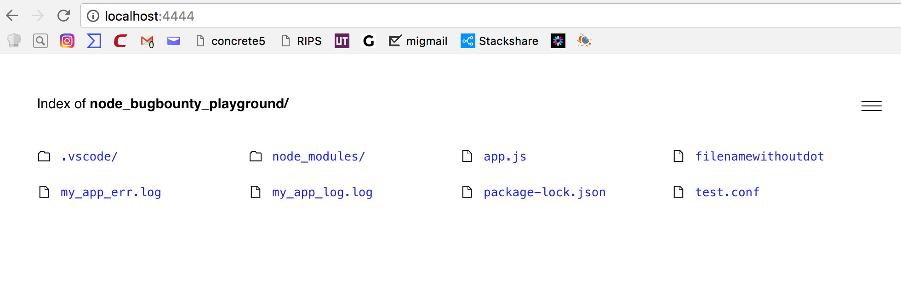
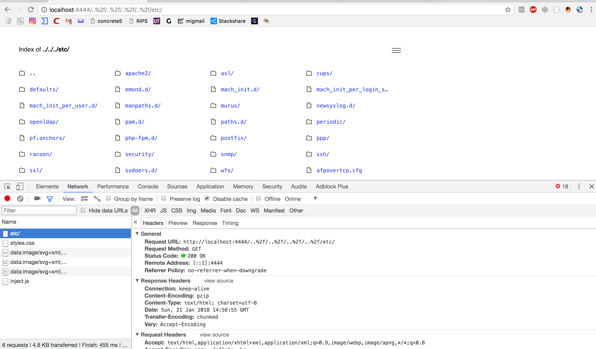
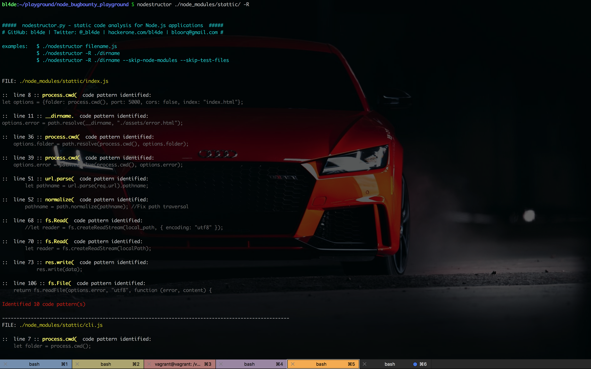

# Most common security vulnerabilities in npm static content/file servers modules

## Intro

If you are JavaScript developer and you are working with Node.js, chances that you've never heard about [npm](https://npmjs.org) are literaly slim. **npm** is a repository where hundreds of thousands ready-to-use modules for your state-of-the-art Node.js application are just waiting to be downloaded and used as a part of your codebase. node_modules directory in your project grows up exponential along with every new feature you are working on.

Maybe it's even more and **you** develop npm modules as well, giving back your work to the community. That's really fantastic, I always encourage to contribute to open source projects and share your work with the others. Developers build this ecosystem and thanks to them it's amazing.

There are many types of modules doing specifing things. One of those things are **serving static content** from your server directly to your users. They can be used for eg. browsing directories, edit files or they just can work as small CDN service for your web application CSS or images.

If you developed already such module or you are going to build one, maybe just for your needs, maybe just for the company you work for - security should be a very important part of your project. 

Unfortunately, this is not always the case.

In December 2017, **[Node.js Ecosystem Bug Bounty Program](https://hackerone.com/nodejs-ecosystem)** emerged on **HackerOne** platform. The very first report, opened by Yasin Soliman [@ysx](https://hackerone.com/ysx) was Path Traversal vunlnerability in ```serve-here``` module and since then, this kind of vulnerability (which in most cases leads to Local File Include) is the most common reported - https://hackerone.com/nodejs-ecosystem/hacktivity?sort_type=latest_disclosable_activity_at&filter=type%3Aall%20to%3Anodejs-ecosystem&page=1&range=forever


 In this post I'd like to present most common security issues in static server npm modules I found in the last couple of weeks. If you do not know what Path Traversal, LFI or XSS issues are - I put links to some basic resources about each of issue and strongly recommend to read and learn what they are and how they can be used against your application users.


## Path Traversal and Local File Include


[Path Traversal](https://www.owasp.org/index.php/Path_Traversal), also known as Directory Traversal, is an issue which allows attacker to go up in directory tree on the remote server, using ```../``` sequence (dot-dot-slash).

This type of vulnerability exists when server takes user input (eg. filename) and uses it to build relative (or absolute) path to static resource, like text file or image. 

This leads to several vulnerabilites, the most common is [Local File Inlclusion](https://www.owasp.org/index.php/Testing_for_Local_File_Inclusion). Very dangerous situation occurs when application allows users to upload files into chosen location. If An attacker is able to change destination path, one is able to upload eg. webshell (simple script which allows to execute system commands on the remote machine) into the directory accessible in the browser and gain an access to the server's command line.


Let's see how this vulnerability can be exploited in the wild.

Presented code comes from [public](https://www.npmjs.com/package/public) npm module:


```javascript
    var pathname = url.parse(req.url).pathname;
    var filePath = path.join(dir, pathname); // Real file path
    var base = filePath.replace(dir, ''); // Base path for browser link
    var abs = path.resolve(filePath); 
    console.log(new Date().toString(), abs);
    fs.readFile(filePath, function(err, data) {  // <-- vulnerable line
      if (err) {
        (...)
      }
      res.writeHead(200, { 'Content-Type': mime.lookup(filePath) });
      res.end(data);
```

In line marked with ```<-- vulnerable line``` comment, you can see ```fs.readFile()``` call, where ```filePath``` is used as an argument.

```filePath``` is build with ```pathname``` argument read from HTTP request. No sanitization was introduced, so if ```pathname``` contains dot-dot-slash sequence, Path Traversal can be exploited.

When ```public``` is run, nothing could stop attacker from reading the content of any file on the server:


```
$ curl -v --path-as-is http://127.0.0.1:8080/../../../../../etc/hosts
```

---

This issue was fixed by the module maintainer. You can read full report on HackerOne here:


[[public] Path Traversal allows to read content of arbitrary files](https://hackerone.com/reports/312918)

---


Another example of vulnerable code comes from [hekto](https://www.npmjs.com/package/hekto) module. First, let's see how path is read from HTTP request:

```javascript
 let file = path.join(process.cwd(), argDir, this.request.url);
 ```

 Now, ```file``` contains full path to requested resource, starting from current working directory (from where server was run). Next, some logic is implemented (not related to the vulnerability though), which takes particular action depends on file extension:


 ```javascript

    if (fs.lstatSync(file).isFile()) {
        this.status = 200;

        if (path.extname(file) == '.html') {
            this.type = 'text/html';
            this.body = fs.createReadStream(file);
        } else if (path.extname(file) == '.css') {
            this.type = 'text/css';
            this.body = fs.createReadStream(file);
        } else {
            const fileBuffer = readChunk.sync(file, 0, 4100);
            const mime = fileType(fileBuffer);

            if (mime) {
                this.type = mime.mime + '; charset=utf-8';
            } else {
                this.type = 'text/plain; charset=utf-8';
            }

            this.body = fs.createReadStream(file);
        }
    }
 ```

 What you should notice here, nowhere in the code ```file``` is checked against existence of ```../``` sequence. This leads directly to Path Traversal vulnerability and allows attacker to read content of arbitrary files.


Solution implemented by module's maintainer simply checks if ```file``` path "fit" inside current appliaction working directory (if ```../``` sequences are present, ```file``` won't pass this condition as it "goes" outside):

```javascript

    if (!isPathInside(file, path.join(process.cwd(), argDir))) {
      this.body = 'Bad Request';
      this.status = 400;

      return;
    }
```


```isPathInside``` method comes from 
[path-is-inside](https://www.npmjs.com/package/path-is-inside) module, which is a good choice if you want to prevent your code against this type of issue. As an author explains in his GitHub repository [README](https://github.com/domenic/path-is-inside/blob/master/README.md) - detection of path is not as trivial as it looks like. 

Incorrect implementation of path resolving routine can easily introduce Path Traversal vulnerability in your code, so always be careful when you build your paths.


---
 You can see the full report on HackerOne here:

 [[hekto] Path Traversal vulnerability allows to read content of arbitrary files](https://hackerone.com/reports/311218)

---


Here's another variant of this attack scenario.

This time, [serve](https://www.npmjs.com/package/serve) module allows to display directory content directly in the browser:





Attacker was able to use ```%2d``` and ```%2f``` characters (an ASCII codes of ```.``` and ```/``` respectively) and forces server to display content of directories outside of the application root:




An issue was [fixed and patch deployed](https://github.com/zeit/serve/pull/316/files) in just 2 days after report was opened. The implementation of fix contains ```decodeUriComponent()``` (see https://developer.mozilla.org/en-US/docs/Web/JavaScript/Reference/Global_Objects/decodeURIComponent)  JavaScript function, which turns URI encoded characters into their ASCII representation, so ```%2f``` becomes ```/``` and ```%2e``` becomes ```.```. This normalization allows to verify if sequence ```../``` is present in the url and does not allow to bypas protection against Path Traversal with various URL encodings (with Unicode or hexadecimal encodings).

---

Full report available on HackerOne can be found here:

[[serve] Directory index of arbitrary folder available due to lack of sanitization of %2e and %2f characters in url](https://hackerone.com/reports/307666)

---


**Remember to always sanitize user input comes from HTTP Request and never use anything which comes from Request directly in code, especially if this code executes calls to the system, like opening and reading files or streams, creating directories and similar methofs from [File System Node.js module](https://nodejs.org/dist/latest-v8.x/docs/api/fs.html)**


## HTML Injection and XSS issues in displayed content

In the last example of Path Traversal vulnerability in **serve** module, an user was able to see the content of directory in the browser. This is not always the case (many static server modules does not expose directory listings), however, in some modules which provide this type of functionality, another problem is quite common.

As any other output displayed in browser, directory listings contains HTML code, mostly built as concatenated string contains HTML tags and directory and files attributes to display them to the users.

Let's take a look at sample code, which comes from [crud-file-server](https://www.npmjs.com/package/crud-file-server) module. This fragment builds HTML output in the way described above, using list of files saved in ```results``` array:


```javascript
    res.setHeader('Content-Type', 'text/html');                                         
    res.write('<html><body>');
    for(var f = 0; f < results.length; f++) {
        var name = results[f].name;
        var normalized = url + '/' + name;
        while(normalized[0] == '/') { normalized = normalized.slice(1, normalized.length); }
        res.write('\r\n<p><a href="/' + normalized + '">' + name + '</a></p>');
    }
    res.end('\r\n</body></html>');
```

Especially this line should be bring to our attention:

```javascript
res.write('\r\n<p><a href="/' + normalized + '">' + name + '</a></p>');
```

It might not be obvious at first sight, but this code contains [XSS](https://www.owasp.org/index.php/Cross-site_Scripting_(XSS)) vulnerability. 


If ```name``` will contain string ```<script>alert('XSS!')</script>```, then the result of this line will be an HTML contains XSS payload send to the browser:

```html
<p><a href="/<script>alert('XSS!')</script>"><script>alert('XSS!')</script></a></p>
```

Of course, ```href``` attribute valueis invalid, but this is not important in this attack scenario. Important is that between ```<a>``` and ```</a>``` tags there is perfectly valid ```<script>``` tag which contains malicious JavaScript code.


When this output will be returned to the browser by ```res.end()``` call, JavaScript will be executed.


Ok, but this is only some teoretical attack vector. To be able to exploit this vulnerability, we need to put ```<script>alert('XSS!')</script>``` as a file name. Of course, instead of ```alert('XSS!')``` JavaScript code in the payload should do something a little bit more malicious than only displaying popup with some message to be considered as a threat for the users.

Creating the file with name ```<script>alert('XSS!')</script>``` is the only way to achieve some code execution in the browser. But, due to operating system, there is no way to create file or directory with ```/``` character in the name. 

Do we need one though?

Not really, because we **do not need to execute JavaScript directly**. We can instead embed ```<iframe>``` element and set its ```src``` attribute to HTML file created in the same directory. And in this HTML file we can implement any logic, including any JavaScript we want. Like ransomware downolader.

So, let's summarize what we need to expolit this:


- we need to create file with following name: ```"><iframe src="malware_frame.html">``` This file does not need to contain any content. We need only the name

- next, we need to create ```malware_frame.html``` file, which will be loaded into the iframe element created in HTML output. Here's very simple example:


```html
<html>

<head>
    <meta charset="utf8" />
    <title>Frame embeded with malware :P</title>
</head>

<body>
    <script>
        alert('You are pwned!')
    </script>
</body>

</html>
```

As a result, when user will open directory listing in the browser, malicious filename will load ```malicious_frame.html``` file and code from this file will execute:


---

Here's the list with links to reports on HackerOne, where this vulnerability was found (and already fixed):


[[simple-server] HTML with iframe element can be used as filename, which might lead to load and execute malicious JavaScript](https://hackerone.com/reports/309641)

[[simplehttpserver] Stored XSS in file names leads to malicious JavaScript code execution when directory listing is output in HTML](https://hackerone.com/reports/309648)

[[anywhere] An iframe element with url to malicious HTML file (with eg. JavaScript malware) can be used as filename and served via anywhere](https://hackerone.com/reports/309394)

[[crud-file-server] Stored XSS in filenames when directory index is served by crud-file-server](https://hackerone.com/reports/311101)

---


To prevent code against this type of issues, an output needs to be escaped before is send to user's browser:


```javascript
return '<li><a href="'
      + escapeHtml(normalizeSlashes(normalize(path.join('/'))))
      + '" class="' + escapeHtml(classes.join(' ')) + '"'
      + ' title="' + escapeHtml(file.name) + '">'
      + '<span class="name">' + escapeHtml(file.name) + '</span>'
      + '<span class="size">' + escapeHtml(size) + '</span>'
      + '<span class="date">' + escapeHtml(date) + '</span>'
      + '</a></li>';

```

This fragment comes from [serve-index](https://github.com/expressjs/serve-index/blob/a399faa1801f02ee1885e5664ed21a9c7990b63a/index.js#L279):) middleware for ```ExpressJS``` framework. Calls to ```escapeHtml()``` comes from [escape-html](https://www.npmjs.com/package/escape-html). Let's see what this function does:

```JavaScript
var matchHtmlRegExp = /["'&<>]/;

// (...) some other code  here

function escapeHtml(string) {
  var str = '' + string;
  var match = matchHtmlRegExp.exec(str);

  if (!match) {
    return str;
  }

  var escape;
  var html = '';
  var index = 0;
  var lastIndex = 0;

  for (index = match.index; index < str.length; index++) {
    switch (str.charCodeAt(index)) {
      case 34: // "
        escape = '&quot;';
        break;
      case 38: // &
        escape = '&amp;';
        break;
      case 39: // '
        escape = '&#39;';
        break;
      case 60: // <
        escape = '&lt;';
        break;
      case 62: // >
        escape = '&gt;';
        break;
      default:
        continue;
    }

    if (lastIndex !== index) {
      html += str.substring(lastIndex, index);
    }

    lastIndex = index + 1;
    html += escape;
  }

```


Not as sophisticated as it might look like for module which is downloaded almost five millions times per week, isn't it? :)


Escaping HTML is quite straightforward operation: you need to change all occurences of special characters like those present in ```matchHtmlRegExp``` in code above and change them into HTML entities. So for example ```<``` will become ```&lt;```, which will still be displayed as ```<``` in the browser, **but** it won't be **interpreted**. So any attempt to embed any of HTML tags, especially ```<script></script>``` pair, which have very bad consequences for your users.


So, instead of input sanitization, like in Path Traversal, this time you need to take care of **output escaping**. Those two rules should become your motto:


> **Always sanitize user input, always escape user output**

Now, you can print this and pin somewhere in front of your eyes :)


## nodestructor - Node.js application static code analysis tool


All presented issues in the code are mostly caused by couple of instructions used to read files or create HTML links with ```<a>``` tag. So from some time, I develop a very simple tool for quick static code analysis in Node application - [nodestructor](https://github.com/bl4de/security-tools/blob/master/nodestructor/nodestructor.py).

When you run this tool and set your project directory as the target (or any npm module directory), you will get a quick info, which files contains some well known code patterns lead to some of presented in this post vulnerabilities:





As you can see, an output contains information about each identified pattern, with line number. At the end of the scan, a summary is presented about how many files were scanned and how many pattrens were identified:


The list of patterns is not very impressive, but I use this tool while looking for the issues in Node.js Ecosystem Bug Bounty program and add any new pattern which looks (for me) suspicious or used in the wrong way (without sanitization of user input) might expose some vulnerability.


Feel free to use it and modify as you want :) It's under the license called "There is no license"


## Summary

Keeping the code secure might be hard from time to time. Some issues are not easy to spot at first point of view. Some of them are not trivial to exploit. 

The fact your code is available online, helps attackers to look for vulnerabilities and use them against your users. 

From the other point of view, the fact that majority of the problems is caused by lack of user input sanitization makes things a little bit easier if you have well defined entry point in your app and use proper sanitization. Escaping output before it's send to the browser is also a good habit.

If you have any questions or you think there is something wrong or missing in this post - feel free to ping me on [Twitter](https://twitter.com/_bl4de) or send an email to ```bloorq``` email address in the Google mail domain.

Stay Safe!

Rafal 'bl4de' Janicki
